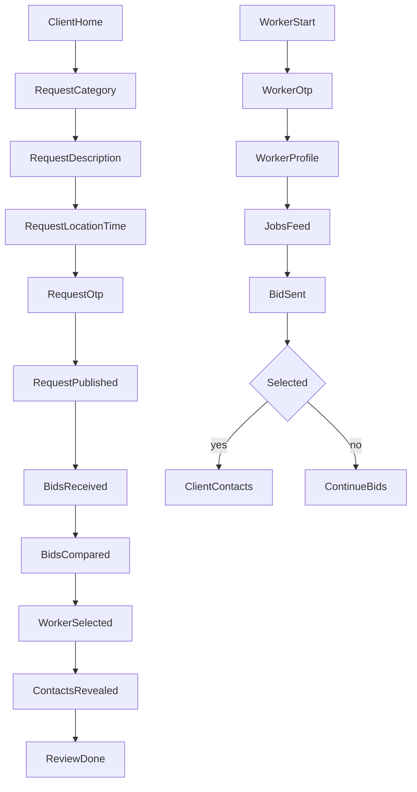

# Core UX Flows (RU/RO)

## 1) Сценарий заказчика: от заявки до выбора мастера

### Цель
Создание заявки за 60-120 секунд и получение первых откликов.

### Шаги

1. Главная (`/`)
   - Выбор действия: `Создать заявку`.
2. Выбор категории (`/request/new`, шаг 1)
   - Обязательное поле: категория услуги.
3. Описание задачи (шаг 2)
   - Обязательное: описание.
   - Опционально: фото (1-6), чипсы "срочно", "нужна смета".
4. Где и когда (шаг 3)
   - Обязательное: город, район.
   - Опционально: бюджет, дата старта.
5. Контакт и публикация (шаг 4)
   - Телефон + OTP/SMS.
   - Чекбокс согласия с правилами.
   - Кнопка: `Опубликовать заявку`.
6. Экран успеха
   - Сообщение о публикации.
   - CTA: `Смотреть отклики`.
7. Карточка заявки (`/jobs/:id`)
   - Сравнение откликов.
   - Выбор мастера.
   - Раскрытие контактов выбранного мастера.
8. Завершение
   - Оставить оценку (1-5) и текст отзыва.

### Валидации

- Без OTP публикация невозможна.
- Минимум: категория + описание + район + телефон.
- Ограничение заявок на номер в сутки (антиспам).

### KPI для потока заказчика

- `request_publish_rate`
- `share_requests_with_photo`
- `time_to_first_bid_minutes`
- `request_to_selection_rate`

## 2) Сценарий мастера: от регистрации до первого отклика

### Цель
Заполнение анкеты и отправка отклика за 30-60 секунд после входа.

### Шаги

1. Вход для мастера (`/for-workers` -> `/auth`)
   - Телефон + OTP/SMS.
2. Анкета мастера (`/account/worker`)
   - Имя, категории, город/районы, опыт, фото работ.
   - Контакты мессенджеров: Viber/Telegram/WhatsApp.
3. Лента заявок (`/jobs`)
   - Фильтры: категория, район, дата, бюджет.
4. Отклик (`/bid/new?jobId=:id`)
   - Цена/диапазон, комментарий, дата старта.
   - Отправка отклика.
5. Статус
   - `Отправлен` / `Выбран` / `Не выбран`.
   - При выборе открываются контакты заказчика.

### Валидации

- Без заполненной анкеты нельзя отправить отклик.
- Лимит частоты откликов и антифрод-проверки на спам.

### KPI для потока мастера

- `worker_profile_completion_rate`
- `worker_first_bid_rate`
- `avg_bids_per_worker_week`
- `worker_selection_rate`

## Mermaid-схема

